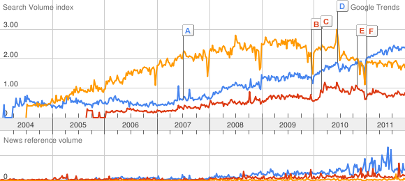

# Git: An overview

---

# What?

Git is:

* a distributed version control system
* a workflow construction toolkit
* "cool"
* not the only choice around, but a good one!

---

# A version control system

Built from the ground-up to be:

* distributed
* fast
* secure
* flexible

---

# A workflow construction toolkit

Allows you (and your team) to control the workflow:

* When do you publish?
* What do you publish?
* Where do you publish to?
* When do you consume?
* Where do you consume from?

---

# Cool ...

Git |
Mercurial |
Svn

---

# Key Concepts

* Blob
* Tree
* Commit
* Ref or "branch"
    * HEAD
    * master
* Remote
    * origin

.notes: Crypto-hash versus name. Mutable vs immutable. Conventions. Relative naming.

---

# Basic workflow

Subversion ...

<ul>
<li><code>svn checkout ...</code></li>
<li><em>edit files</em></li>
<li><code>svn status</code></li>
<li><code>svn commit</code></li>
</ul>

Git ...

<ul>
<li><code>git clone ...</code>
  <ul>
  <li><em>edit files</em></li>
  <li><code>git status</code></li>
  <li><code>git commit</code></li>
  <li><em>edit files</em></li>
  <li><code>git commit</code></li>
  <li>...</li></ul></li>
<li><code>git push</code></li>
</ul>

.notes: Separates commit/publish. Solves the "big change" problem.

---

# Syncing workflow

Subversion ...

<ul>
<li><code>svn update</code></li>
</ul>

Git ...

<ul>
<li><strike><code>git pull</code></strike></li>
<li><code>git fetch</code></li>
<li><code>git merge</code></li>
</ul>

.notes: Solves the oh-crap-bad-merge problem.

---

# Sharing workflow

Subversion ...

<ul>
<li><code>svn commit</code>
  <ul>
    <li>Magic happens on the server</li>
  </ul></li>
</ul>

Git ...

<ul>
<li><code>git push</code>
  <ul>
  <li>No magic on the server. Resolve yourself</li>
  </ul></li>
</ul>

.notes: Can solve the semantic "merge" problem.

---

# Branches

    # Create a new branch
    $ git branch dev
    $ git branch
      dev
    * master
    $ git checkout dev
    * dev
      master

    # Interrupted by manager
    $ git checkout -b bug-fix master
    # Take advantage of incremental compile

---

# Interlude: Commits/Branches

What makes a good commit?

* One logical change per commit
    * Easy to understand
    * Easy to back out
* Well documented and tested

What makes a good branch?

* One functional change per branch

---

# All Your Rebase Are Belong to You

The question: How to handle divergent development?

* Divergence happens daily!
* Are merges semantically meaningful?
    * Yes: Actually combining two lines of dev. Create a merge commit
    * No: Artifact of syncing. Do *not* merge; rebase
    * (This is a point of contention and aesthetics.)
* Do you care what your history looks like?
    * History as a teacher
    * What part of the past really matters?

---

# Rebase as a merge replacement

* Git history is immutable!
* Git refs are not.  So you can "edit" history.
* Rebase attempts to replay your commits against a new base.

---

# Rebase example

    $ git checkout -b dev
    $ git commit -m "one"
    $ git commit -m "two"
    $ git commit -m "three"
    $ git fetch origin
    $ git rebase origin/master
    First, rewinding head to replay your work on top of it...
    Applying: one
    Applying: two
    Applying: three
    $ git branch
    * dev
      master

---

# Rebase as history editor

    $ git rebase -i origin/master
    *editor*
    pick 8953dff one
    pick 1e16de0 two
    pick 9c9c6e3 three

    # Rebase 1906475..9c9c6e3 onto 1906475
    #
    # Commands:
    #  p, pick = use commit
    #  r, reword = use commit, but edit the commit message
    #  e, edit = use commit, but stop for amending

Re-work your own history before sharing it!

Crypto protects everyone else.

---

# Merge/Rebase summary

* A merge commit *exposes* the act of merging
* A rebased branch can *hide* parallel development
* Rebase can be used to clean up history to make it
  easier to understand

Which you choose is a function of your team aesthetics

---

# Workflows

* Centralized server
* Integration manager
* Trusted lieutenant

---

# Some downsides

* You have to learn abstract model to use effectively
* Some commands can be confusing
* Windows support is not as great
* Distributed may make your compliance office worry

---

# Great community and resources

* http://github.com/
* http://whygitisbetterthanx.com/
* http://progit.org/
* http://git-casts.com/

---

# Closing ...

* Git is fast and flexible
    * Doesn't get in your way
    * Let's you operate how you want
* Encourages better software practice
    * Lightweight branching for isolating unrelated changes
    * Local commits for better safety
    * Safe history manipulation

---
# Questions?
